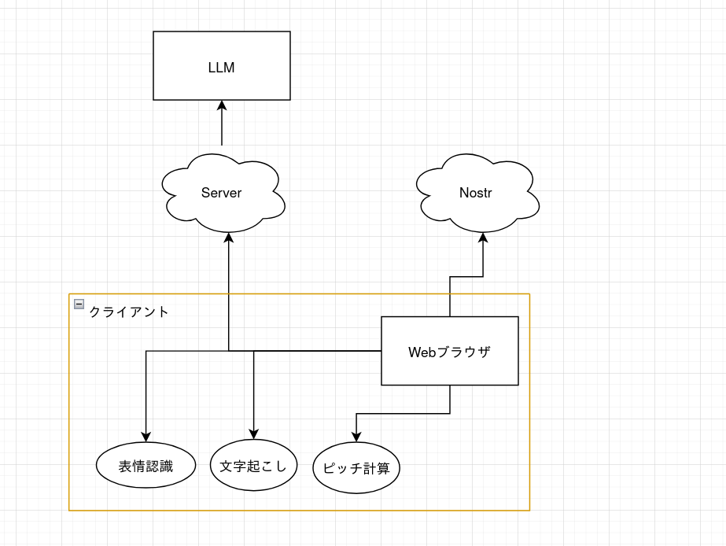

# 今日やったこと

---

# 自己紹介

  

    
    <h2 class="text-gray-500 font-bold mt-4">@akazdayo</h2>
    <h1 class="mt-2">あかず</h1>
  

  

    <h2>趣味</h2>
    

      <ul>
        <li>プログラミング
          <ul>
            <li>Typescript</li>
            <li>Nix</li>
            <li>その他</li>
          </ul>
        </li>
        <li>ゲーム
          <ul>
            <li>osu!</li>
            <li>VRChat</li>
            <li>etc...</li>
          </ul>
        </li>
      </ul>
    

---

# 今日やったこと

- テーマをLLMに考えさせて、複数並列でLLMに全部作らせる
  - **会話の温度計**
  - デスクトップの作業を記録して何をしていたかのTLを作る
  - 会話の温度に合わせてサーモグラフを作成する

---

# 課題

 

## 今私が何をしていて、次に何をしないといけなくて、元々何をしていたんだっけ！

---
layout: two-cols
---

# できること

- 会話のテンションをリアルタイムで可視化
- 話の盛り上がりを直感的に把握できる
- 過去の作業を振り返りやすく
- 「何してたっけ？」を解決

---

# どうやって動いてるの

- 以下の情報を参照している
  - 文字起こし
  - 声のピッチ
  - 無言の割合
  - カメラから取得する表情

- 上記の情報をすべてLLMに投げて、判定している
- 今回は速度が命だったのでgemma4-e4bをローカルで動かしている

---

# 技術的な話

- Next.js
- LLMはローカルで対応
- 推しポイント
  - 表情認識, 文字起こし、ピッチ認識など基本的にはほぼ全部ブラウザで動く

---

---
layout: two-cols
---

# これを使うと面白そうなこと

- カメラを使用しないアバターコミュニケーション(POPOPOなど)において、表情とか、身振り手振りとか。自動化できる
- アツい話をしてたら、アツい感じの動きをアバターがする！的な
- VRChatでも使えそう. ゴーグルを被るとカメラ使えないから

::right::

<video src="https://www.popopo.com/ja/assets/movie/about.mp4" controls loop class="w-full rounded-lg shadow-lg"></video>
