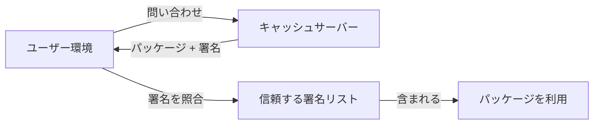
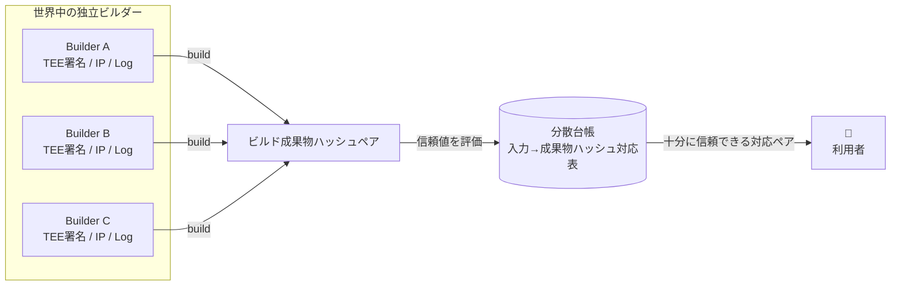

# テーマ概要

野田 蒼馬 / あかず
SecHack365 世界観駆動コース

---
src: ../../shared/components/slidev/self-introduction.md
---

---
layout: center
---

# テーマ概要

---

# <simple-icons-nixos class="text-4xl inline-block" /> Nix とは？

宣言的なパッケージ管理・ビルドツール。

- **再現性**: 同じ設定ファイルから、誰がどこでビルドしても同一の環境を作れる
- **サンドボックスビルド**: ネットワーク遮断・専用ディレクトリでビルド → 副作用がない

  引用: asa1984「純粋関数的ビルド」『Nix入門』Zenn

---
layout: fact
---

## Nixってすごく面倒くさい！

---

# Why

- **サンドボックス上でビルドするため、ビルドがありえないほど遅い**
- **すべてサンドボックスでビルドするのでサンドボックス内でキャッシュを使いづらい**
- 細かいバージョンの指定がしにくい。(これはnixpkgsに対する不満)
- ディスク容量を非常に圧迫する
- 再現性の都合上すべてgitリポジトリに含めるのでsecretを管理しにくい
- Linux FHS非準拠なので一部ソフトウェアが動かない
- 学習曲線が急

---
layout: center
---

- **ビルドがありえないほど遅い**
- **キャッシュを使いづらい**

---
layout: center
---

# それを解決したい！

---

# 現状それを解決するもの

**Binary Cache**: ビルド済みの成果物をキャッシュして配布

- キャッシュを持つサーバー, 各パッケージのキャッシュに対する署名の２つがある
- キャッシュサーバーに問い合わせ → パッケージをもらう → 信頼する署名リストに含まれるか確認

---

# Binary Cacheの課題

Binary Cacheは「ビルド時間」を短縮できる一方で、**ビルド結果を誰が作り、どこまで信用できるか**という問題が残る

- **カバレッジ**: キャッシュが存在しないパッケージは、結局ローカルで長時間ビルドする必要がある
- **信頼**: 署名者を信頼するモデルなので、小規模・個人運用のキャッシュは採用しづらい
- **検証**: ビルドをしないので、本当にそのソースコードから生成されたものか検証できない
  - Nixは再現性を求める言語なのでキャッシュによって再現性が失われてはならない
  - Chrome入れたと思ったらChromiumだった！？！？！は嫌

---

# 提案するアプローチ

- **入力ハッシュに対して対応するビルド成果物ハッシュの対応表を分散台帳上に作りたい**
  - 世界中のマシンでビルドして、TEE署名や、IP, Logなどを用いてビルダーの独立性などを評価し、対応するペアの信頼値を評価する
  - 「これが絶対に正しい！」を言い切るのは諦めた。

---

# 課題

- Sybil攻撃
- 実際どんなアルゴリズムでスコアリングするか
  - 現状はTEE, IPのAS番号, log情報, とか？？
  - ゼロ知識証明を使用できればアツいが、Nixのビルド全体を証明対象にするのは難しそう
- マルウェア検出ツールとの併用
  - 対象の入出力ペアが間違っている可能性があるということはマルウェアなどが混入する可能性などもある
  - VirusTotalなどを使えば良さそうだけど、私にそのあたりの知識がないのでわからない...！

---
layout: center
---

# 一年間よろしくお願いします！
