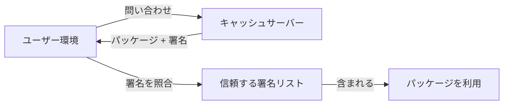

# テーマ概要

野田 蒼馬 / あかず
SecHack365 世界観駆動コース

---
src: ../../shared/components/slidev/self-introduction.md
---

---
layout: center
---

# テーマ概要

---

# <simple-icons-nixos class="text-4xl inline-block" /> Nix とは？

宣言的なパッケージ管理・ビルドツール。

- **再現性**: 同じ設定ファイルから、誰がどこでビルドしても同一の環境を作れる
- **サンドボックスビルド**: ネットワーク遮断・専用ディレクトリでビルド → 副作用がない

  引用: asa1984「純粋関数的ビルド」『Nix入門』Zenn

---
layout: fact
---

## Nixってすごく面倒くさい！

---

# Why

- **サンドボックス上でビルドするため、ビルドがありえないほど遅い**
- **すべてサンドボックスでビルドするのでサンドボックス内でキャッシュを使いづらい**
- 細かいバージョンの指定がしにくい。(これはnixpkgsに対する不満)
- ディスク容量を非常に圧迫する
- 再現性の都合上すべてgitリポジトリに含めるのでsecretを管理しにくい
- Linux FHS非準拠なので一部ソフトウェアが動かない
- 学習曲線が急

---
layout: center
---

- **ビルドがありえないほど遅い**
- **キャッシュを使いづらい**

---
layout: center
---

# それを解決したい！

---

# 現状それを解決するもの

**Binary Cache**: ビルド済みの成果物をキャッシュして配布

- キャッシュを持つサーバー, 各パッケージのキャッシュに対する署名の２つがある
- キャッシュサーバーに問い合わせ → パッケージをもらう → 信頼する署名リストに含まれるか確認

---

# Binary Cacheの課題

  「署名者」は確認できる。しかし、「その入力からできた成果物か」は確認できない。

  

    

      

        
👤

        
利用者

      

      

        
取得

        
→

      

      

        
Binary Cache

        
成果物 + 署名

      

      

        
署名を照合

        
→

      

      

        
信頼済み 公開鍵リスト

      

    

    

      わかるのは「誰が署名したか」まで — 入力 → 成果物の正しさは別問題
    

  

  

    

      <b>信頼</b> 署名者そのものを信じる必要がある
    

    

      <b>検証</b> 本当にそのソースから生成されたかは不明
    

    

      <b>カバレッジ</b> 未登録のパッケージは結局ローカルビルド
    

  

---

# 提案するアプローチ

  署名者ではなく、<b>複数の独立したビルド結果</b>を根拠に成果物を判断する。

  

    
世界中の独立ビルダー

    

      
<b>Builder A</b> TEE / IP / Log

      
<b>Builder B</b> TEE / IP / Log

      
<b>Builder C</b> TEE / IP / Log

    

    
↓

    

      <b>同じ入力をそれぞれビルド</b> 
      入力ハッシュ → 成果物ハッシュ
    

    
↓

    

      <b>分散台帳に記録</b> 一致度 + 独立性から信頼値を算出
    

  

  

    

      

        
👤

        
利用者

      

      

        
成果物を取得

        
→

      

      

        <b>Binary Cache</b> 成果物
      

      

        
ハッシュを照合

        
→

      

      

        <b>台帳の 信頼値</b>
      

    

    

      台帳は成果物を配布しない。 利用者が「この成果物を使うか」判断するための証拠を提供する。
    

    

      目標は「絶対に正しい」の証明ではなく、判断できる材料を増やすこと
    

  

---

# 課題

- Sybil攻撃
- 実際どんなアルゴリズムでスコアリングするか
  - 現状はTEE, IPのAS番号, log情報, とか？？
  - ゼロ知識証明を使用できればアツいが、Nixのビルド全体を証明対象にするのは難しそう
- マルウェア検出ツールとの併用
  - 対象の入出力ペアが間違っている可能性があるということはマルウェアなどが混入する可能性などもある
  - VirusTotalなどを使えば良さそうだけど、私にそのあたりの知識がないのでわからない...！

---
layout: center
---

# 一年間よろしくお願いします！
